# Motion
Movie Information

## Android Jetpack
Jetpack is a suite of libraries to help developers follow best practices, reduce boilerplate code, and write code that works consistently across Android versions and devices so that developers can focus on the code they care about.
<p align="center">
  
</p>


## How to build on your environment
Add your API key in local.properties file.
```xml
MOVIE_TOKEN=""
```
## Architecture
Using MVVM Architecture
<p align="center">
  
</p>

## Specs & Open-source libraries
- Minimum SDK 16
- 100% Kotlin based
- TMDB API
- MVVM Architecture
- Architecture Components (Lifecycle, LiveData, ViewModel, Room Persistence)
- DataBinding
- Material Design & Animations
- [Dagger2](https://github.com/google/dagger) for dependency injection
- [Retrofit2 & Gson](https://github.com/square/retrofit) for constructing the REST API
- [OkHttp3](https://github.com/square/okhttp) for implementing interceptor, logging and mocking web server
- [Glide](https://github.com/bumptech/glide) for loading images
- [BaseRecyclerViewAdapter](https://github.com/skydoves/BaseRecyclerViewAdapter) for implementing adapters and viewHolders
- [Mockito-kotlin](https://github.com/nhaarman/mockito-kotlin) for Junit mock test
- [Bubble Navigation](https://github.com/gauravk95/bubble-navigation) for bottom navigation
- [Lootie](https://github.com/airbnb/lottie-android) for Loading animation
- [ChipGroup](https://github.com/BelooS/ChipsLayoutManager) for Button filter

## Documentation

### State and Activity
|Splash                 |   Blank State             |   Blank Favorite      |   Detail Activity |
|:------------------:|:----------------------------:|:---------------------:|:-----------------:|
| <span align="center">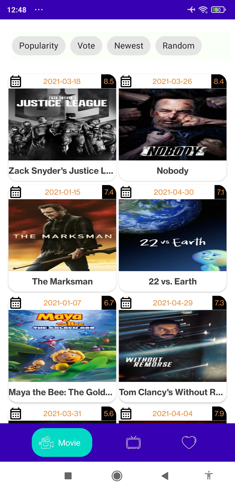</span> | <span align="center">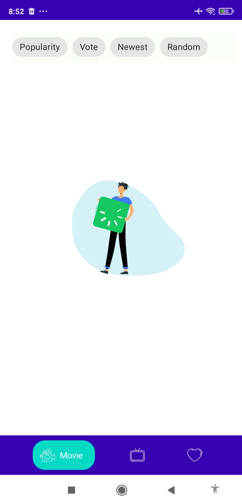</span> | <span align="center">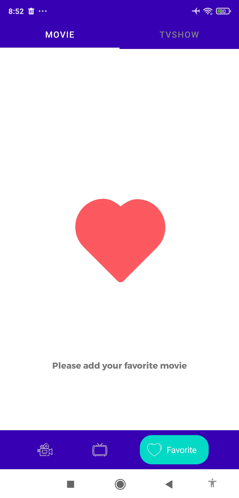</span> | <span align="center">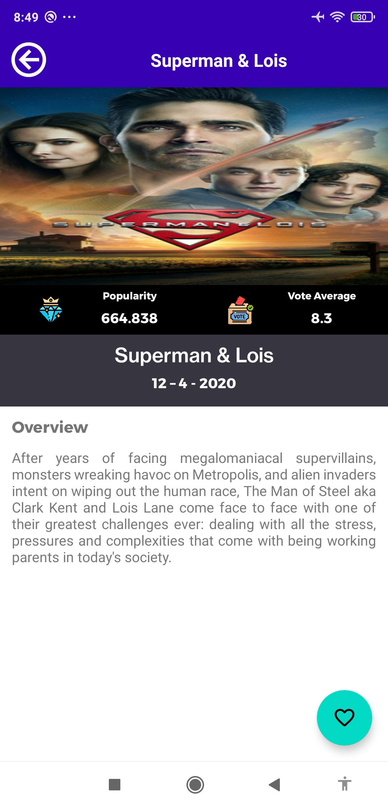</span> |

### Activity
|Movie                 |   TVShow                   |   Favorite Movie           |   Favorite TVShow      |
|:------------------:|:----------------------------:|:---------------------:|:-----------------:|
| <span align="center"></span> | <span align="center">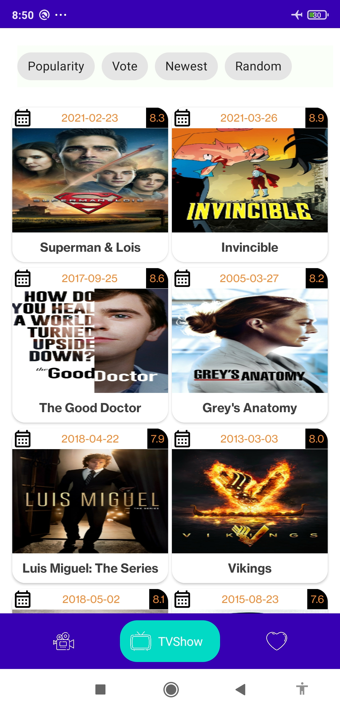</span> | <span align="center">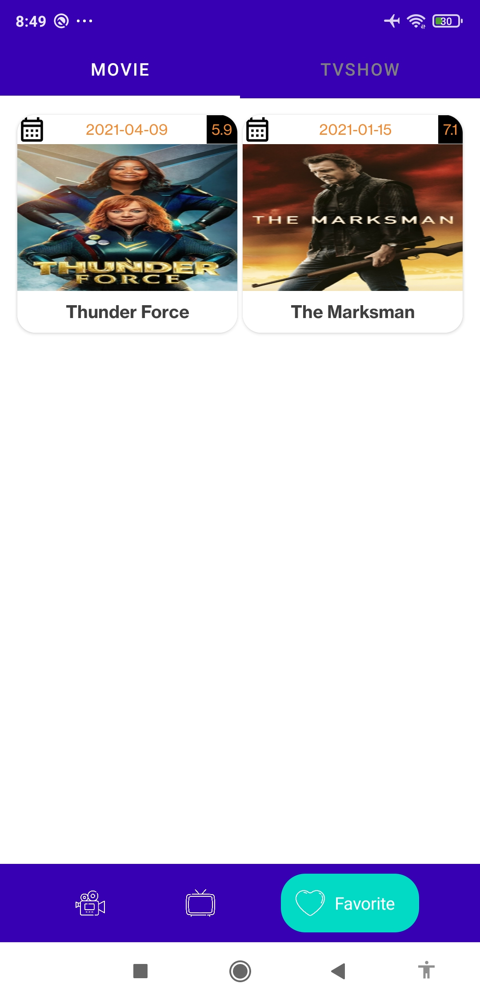</span> | <span align="center">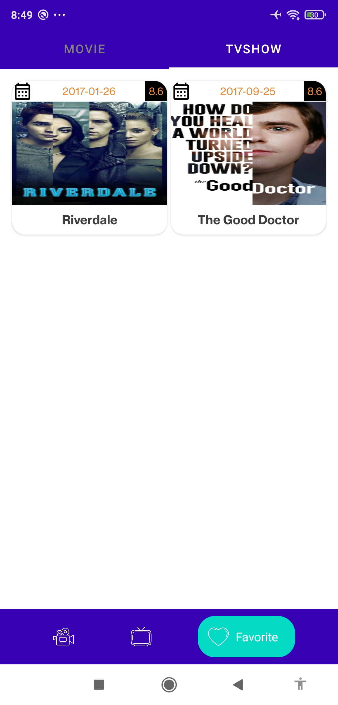</span> |

### Filter
|Popularity          |   Vote                       |   Newest              |   Random          |
|:------------------:|:----------------------------:|:---------------------:|:-----------------:|
| <span align="center">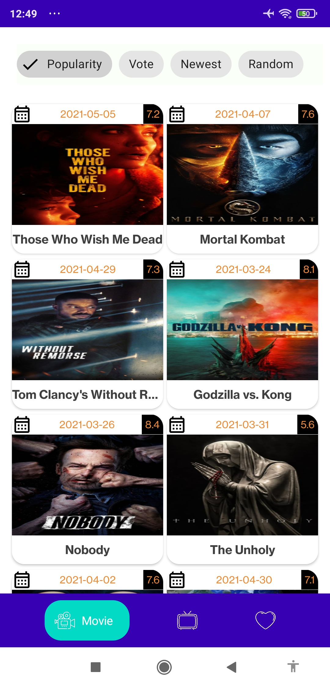</span> | <span align="center">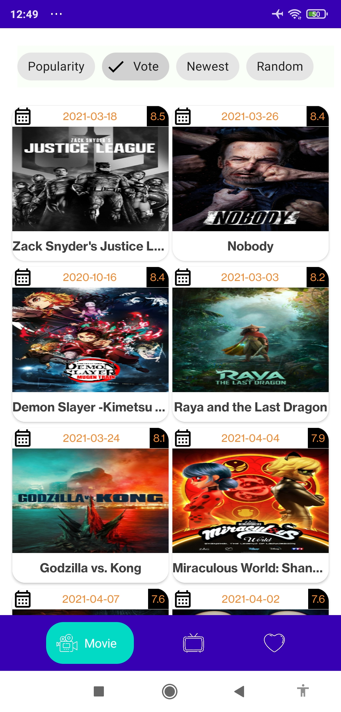</span> | <span align="center">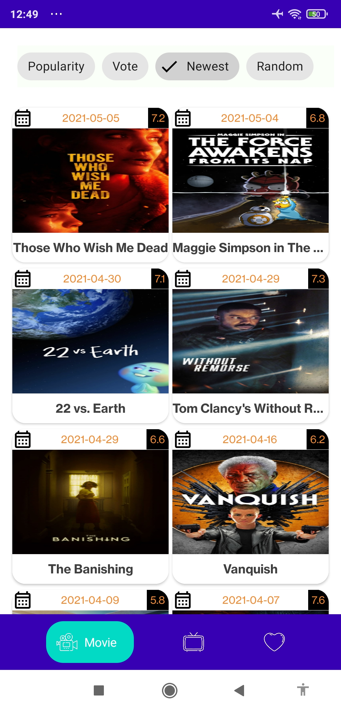</span> | <span align="center">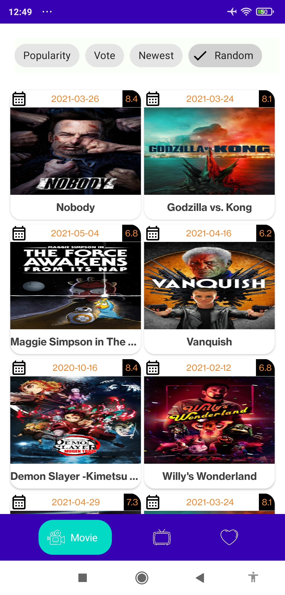</span> |
